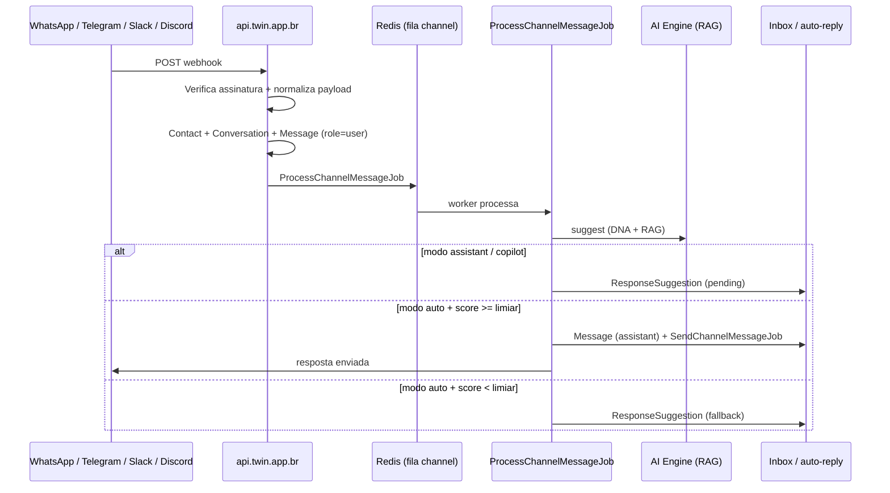

# Canais de atendimento (live)

O TWIN distingue dois fluxos de mensagens:

| Fluxo | Objetivo | Onde configurar |
|-------|----------|-----------------|
| **Importação (treino)** | Ingerir histórico exportado para DNA, embeddings e RAG | [Importar conversas](/import/channels) |
| **Canais live (bot)** | Receber mensagens em tempo real, gerar resposta com RAG e enviar (ou sugerir) | [Configurações → Canais](/settings/channels) |

A importação **não** conecta um bot. Ela alimenta a base de conhecimento do twin. Os canais live usam webhooks da API e o pipeline de IA em tempo real.

---

## Canais suportados (live)

| Canal | Integração | Credenciais |
|-------|------------|-------------|
| **WhatsApp** | Meta Cloud API (Business) | Phone Number ID, Access Token, Verify Token, App Secret |
| **Telegram** | Bot API | Bot Token |
| **Slack** | Events API | Bot Token, Signing Secret |
| **Discord** | Interactions / Gateway (limitado) | Bot Token, Public Key |

**Não suportado:** Baileys, Evolution API, WhatsApp Web não oficial ou qualquer bridge que não seja a API oficial da Meta.

---

## Arquitetura



### Endpoint do webhook

Cada credencial de canal recebe um token único. A URL exibida em **Configurações → Canais** segue o padrão:

```text
https://api.twin.app.br/api/webhooks/channel/{canal}/{webhook_token}
```

Exemplos:

- WhatsApp: `.../webhooks/channel/whatsapp/{token}`
- Telegram: `.../webhooks/channel/telegram/{token}`

O token identifica organização, twin e canal. Requisições inválidas ou duplicadas (mesmo `message_id` da plataforma) são ignoradas.

### Filas

`ProcessChannelMessageJob` e `SendChannelMessageJob` usam a fila **`channel`** no Redis. O worker Supervisor deve processar `default` **e** `channel` — ver [checklist de produção](#checklist-de-produção).

---

## Modos de resposta

Configure em [Configurações → Canais](/settings/channels) ao conectar ou editar um canal.

| Modo | Comportamento na UI | Comportamento no código |
|------|---------------------|-------------------------|
| **Assistente** | Só gera sugestões — nunca envia automaticamente | Cria `ResponseSuggestion` com status `pending` |
| **Copiloto (aprovação)** | Sugestões vão para a [Inbox](/inbox) antes de enviar | **Idêntico ao assistente** — também cria sugestão `pending` |
| **Agente (autônomo)** | O twin responde sozinho no canal (ex.: WhatsApp) quando a confiança atinge o limiar | Se score ≥ limiar → envia via `SendChannelMessageJob` + registra sugestão `sent`; senão → inbox (`auto_fallback`) |

### Limiar de confiança (modo agente)

- Ajustável entre **50% e 95%** (padrão **75%**).
- O score vem do motor de IA (`confidence` ou `score` na resposta do `suggest`).
- Abaixo do limiar, a resposta vira sugestão na inbox com metadado `auto_fallback: true` em vez de ser enviada ao contato.
- No modo agente, o pipeline envia o **histórico recente da conversa** e a memória de sessão ao AI Engine, para o vendedor clonado continuar o diálogo (não só a última mensagem).

> **Nota:** Hoje `assistant` e `copilot` são tratados da mesma forma no backend (`ProcessChannelMessageJob`). A diferença é apenas conceitual na interface; ambos exigem aprovação manual na [Inbox](/inbox) para enviar ao canal.

---

## Configuração: WhatsApp Business (Meta Cloud API)

Produção: `twin.app.br` / `api.twin.app.br`.

### 1. App e número no Meta for Developers

1. Acesse [developers.facebook.com](https://developers.facebook.com/) → **Meus apps** → criar app tipo **Business**.
2. Adicione o produto **WhatsApp** → **API Setup**.
3. Anote o **Phone number ID** e gere um **Access Token** permanente (System User + token com permissão `whatsapp_business_messaging`).
4. Em **App settings → Basic**, copie o **App Secret**.

### 2. Verify Token

Escolha uma string aleatória longa (ex.: `openssl rand -hex 24`). Será o **Verify Token** no TWIN e no painel da Meta.

### 3. Conectar no TWIN

1. Abra [Configurações → Canais](https://twin.app.br/settings/channels).
2. Selecione o **twin**, canal **WhatsApp Business API**, modo de resposta e preencha:
   - Phone Number ID
   - Access Token
   - Verify Token
   - App Secret
3. Salve e copie a **URL do webhook** exibida na credencial criada.

### 4. Webhook na Meta

1. WhatsApp → **Configuration** → **Webhook** → **Edit**.
2. **Callback URL:** URL copiada do TWIN (`https://api.twin.app.br/api/webhooks/channel/whatsapp/...`).
3. **Verify token:** o mesmo Verify Token cadastrado no TWIN.
4. Assine o campo **messages** (e desmarque campos desnecessários).
5. Clique em **Verify and save** — a API responde ao challenge `hub.challenge` automaticamente.

### 5. Teste

Envie uma mensagem de texto para o número Business. A conversa deve aparecer em [Inbox](/inbox) ou receber resposta automática (modo autônomo com score alto).

---

## Configuração: Telegram

### 1. Criar o bot

1. No Telegram, fale com [@BotFather](https://t.me/BotFather).
2. `/newbot` → defina nome e username.
3. Copie o **Bot Token**.

### 2. Conectar no TWIN

1. [Configurações → Canais](https://twin.app.br/settings/channels) → canal **Telegram** → informe o Bot Token.
2. Copie a **URL do webhook** gerada.

### 3. Registrar webhook (manual)

Substitua `{TOKEN}` pelo token do bot e `{WEBHOOK_URL}` pela URL do TWIN:

```bash
curl -X POST "https://api.telegram.org/bot{TOKEN}/setWebhook" \
  -d "url={WEBHOOK_URL}" \
  -d "secret_token={SECRET_TOKEN}"
```

Resposta esperada: `{"ok":true,"result":true,"description":"Webhook was set"}`.

**Recomendado em produção:** passe `secret_token` no `setWebhook` e grave o mesmo valor em `credentials.secret_token` do canal no TWIN. A API valida o header `X-Telegram-Bot-Api-Secret-Token`. Sem `secret_token`, a identidade continua dependendo do `webhook_token` na URL.

Para conferir:

```bash
curl "https://api.telegram.org/bot{TOKEN}/getWebhookInfo"
```

### 4. Teste

Envie `/start` ou qualquer texto ao bot. Mensagens **somente texto** são processadas.

---

## Slack e Discord (resumo)

### Slack

1. Crie um app em [api.slack.com/apps](https://api.slack.com/apps).
2. **OAuth & Permissions** → Bot Token Scopes: `chat:write`, `channels:history`, `im:history` (conforme necessidade).
3. **Event Subscriptions** → Request URL = webhook do TWIN (`.../webhooks/channel/slack/...`).
4. Inscreva-se em `message.channels` / `message.im`.
5. **Basic Information** → Signing Secret.
6. Cadastre Bot Token + Signing Secret no TWIN.

### Discord

1. Crie app em [discord.com/developers](https://discord.com/developers/applications).
2. Bot → copie **Bot Token**; **General Information** → **Public Key**.
3. Cadastre no TWIN. O endpoint responde PING (type 1) para verificação de assinatura Ed25519.

> O inbound do Discord é **frágil**: o normalizador espera eventos `MESSAGE_CREATE` (type 0). Webhooks de interação padrão não entregam mensagens de canal da mesma forma que o Gateway; em muitos cenários só o envio de respostas (após aprovação na inbox) funciona de forma confiável.

---

## Limitações conhecidas

| Limitação | Detalhe |
|-----------|---------|
| Sem Baileys / Evolution | Apenas WhatsApp **Meta Cloud API** oficial |
| Somente texto | Mídia, áudio, stickers e reações são ignorados (`normalize` retorna `null`) |
| Discord inbound frágil | Recepção de mensagens depende de payload type 0; setup típico de bot Discord pode não disparar o pipeline |
| `assistant` = `copilot` no código | Ambos criam sugestão pendente; envio só após aprovação na inbox |
| Um twin por credencial | Cada conexão de canal vincula um twin específico |
| Assinatura obrigatória em produção | WhatsApp exige `app_secret`; sem ele, webhooks são rejeitados em `APP_ENV=production` |

---

## Checklist de produção

Antes de colocar canais live em `twin.app.br`:

- [ ] `APP_ENV=production`, `APP_DEBUG=false` em `apps/api/.env`
- [ ] `QUEUE_CONNECTION=redis` e Redis acessível (`redis-cli ping`)
- [ ] `REDIS_PASSWORD` configurado se o Redis do aaPanel exige senha
- [ ] Supervisor `twin-queue` com **`--queue=default,channel`** (não apenas `default`)
- [ ] `twin-ai-engine` e `twin-celery` ativos (`supervisorctl status`)
- [ ] `AI_ENGINE_SECRET` idêntico em API e AI Engine (com aspas se houver `#`)
- [ ] Tenant provisionado (`php artisan tenants:provision`)
- [ ] Twin com DNA ativo e histórico importado (recomendado para RAG útil)
- [ ] Credencial de canal **ativa** em [Configurações → Canais](/settings/channels)
- [ ] Webhook configurado na plataforma (Meta / Telegram `setWebhook` / Slack Events)
- [ ] Teste: mensagem inbound → job na fila `channel` → sugestão na [Inbox](/inbox) ou resposta automática

### Supervisor (VPS)

O arquivo de referência é `infra/aapanel/supervisor-twin.conf.example`. O comando do worker deve incluir ambas as filas:

```ini
command=.../php artisan queue:work redis --queue=default,channel --sleep=3 --tries=3 --max-time=3600
```

Sem a fila `channel`, webhooks retornam `200 ok` mas **nenhuma sugestão ou resposta** é gerada.

Detalhes de deploy: [docs/deployment/aapanel.md](../deployment/aapanel.md).

---

## Extensão Copilot (WhatsApp Web)

Para atendimento pelo **WhatsApp Web** no navegador (sem Business API), use a extensão TWIN Copilot — leitura/injeção no DOM, modo copiloto. Guia completo (extensão + Business API): [whatsapp-copilot.md](./whatsapp-copilot.md).

---

## Links úteis

| Recurso | URL |
|---------|-----|
| WhatsApp Copilot + Business API | [whatsapp-copilot.md](./whatsapp-copilot.md) |
| Configurar canais live | [twin.app.br/settings/channels](https://twin.app.br/settings/channels) |
| Inbox (aprovar envios) | [twin.app.br/inbox](https://twin.app.br/inbox) |
| Importar histórico para treino | [twin.app.br/import/channels](https://twin.app.br/import/channels) |
| API webhooks | `https://api.twin.app.br/api/webhooks/channel/{canal}/{token}` |
