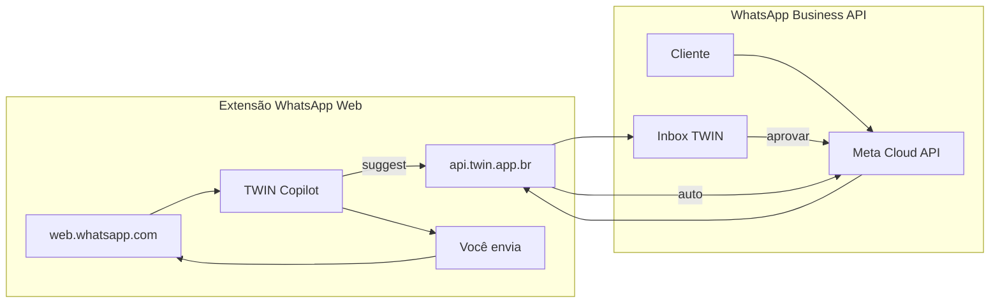

# WhatsApp + TWIN — Copiloto e Business API

O TWIN oferece **dois fluxos complementares** para atendimento no WhatsApp:

| Fluxo | Para quem | Como funciona |
|-------|-----------|---------------|
| **Extensão Copilot (WhatsApp Web)** | Quem usa WhatsApp Web no computador | Extensão lê a conversa, sugere resposta; você envia manualmente |
| **WhatsApp Business API (Meta Cloud)** | Atendimento oficial em escala / mobile | Webhook recebe mensagens, twin responde ou sugere na Inbox |

Ambos usam o mesmo twin treinado (DNA + RAG). A diferença é **como a mensagem entra e sai** do WhatsApp.

---

## 1. Extensão Copilot — WhatsApp Web

Ideal para quem já atende pelo **WhatsApp Web** no navegador e quer sugestões no estilo do twin sem trocar de ferramenta.

### Pré-requisitos

- Conta TWIN com twin treinado (importação de histórico recomendada)
- Chrome ou Edge
- Sessão ativa no painel TWIN (para importar token) ou token manual

### Instalação passo a passo

1. **Carregar a extensão**
   - Abra `chrome://extensions` ou `edge://extensions`
   - Ative **Modo do desenvolvedor**
   - **Carregar sem compactação** → pasta `apps/browser-extension/`

2. **Configurar credenciais**
   - Clique no ícone TWIN Copilot
   - URL da API: `https://api.twin.app.br/api/v1` (produção) ou `http://localhost:8080/api/v1` (local)
   - Token e organização:
     - Botão **Importar do TWIN Web** (com [twin.app.br](https://twin.app.br) aberto e logado), ou
     - Cole manualmente:
       - Token: `localStorage.getItem('twin_token')`
       - Organização: `localStorage.getItem('twin_organization_id')`
   - Selecione o **twin** → **Atualizar lista** → **Salvar**

3. **Usar no WhatsApp Web**
   - Acesse [web.whatsapp.com](https://web.whatsapp.com)
   - Abra uma conversa
   - No painel lateral TWIN: **Sugerir resposta**
   - Revise, **Copiar** ou **Inserir no WhatsApp**
   - Envie a mensagem manualmente (modo copiloto)
   - Opcional: **Aceitar/Rejeitar** para feedback de treino

### O que a extensão faz e não faz

| Faz | Não faz |
|-----|---------|
| Lê última mensagem recebida ou texto selecionado | Enviar mensagens automaticamente |
| Chama `POST /api/v1/suggest` | Usar Baileys, Evolution ou APIs não oficiais |
| Mostra score e breakdown de similaridade | Ler áudio, imagem ou sticker |
| Injeta texto no campo de composição | Substituir WhatsApp Business API |

Detalhes técnicos: [apps/browser-extension/README.md](../../apps/browser-extension/README.md).

---

## 2. WhatsApp Business — Meta Cloud API

Para receber mensagens de clientes no **número Business oficial** e responder com o twin (copiloto, assistente ou autônomo).

### Pré-requisitos

- App Meta for Developers (tipo Business) com produto WhatsApp
- Número WhatsApp Business verificado
- TWIN em produção (`api.twin.app.br`) com fila Redis `channel` ativa
- Twin treinado com histórico importado

### Passo a passo

#### 1. Criar app e número na Meta

1. [developers.facebook.com](https://developers.facebook.com/) → **Meus apps** → app **Business**
2. Adicione **WhatsApp** → **API Setup**
3. Anote **Phone Number ID**
4. Gere **Access Token** permanente (System User + permissão `whatsapp_business_messaging`)
5. Em **App settings → Basic**, copie o **App Secret**

#### 2. Verify Token

Gere uma string aleatória segura (ex.: `openssl rand -hex 24`). Será usada no TWIN e na Meta.

#### 3. Conectar no TWIN

1. [Configurações → Canais](https://twin.app.br/settings/channels)
2. Selecione o **twin**
3. Canal: **WhatsApp Business API**
4. Modo de resposta (veja tabela abaixo)
5. Preencha: Phone Number ID, Access Token, Verify Token, App Secret
6. Salve e copie a **URL do webhook** gerada

#### 4. Configurar webhook na Meta

1. WhatsApp → **Configuration** → **Webhook** → **Edit**
2. **Callback URL:** URL copiada do TWIN  
   `https://api.twin.app.br/api/webhooks/channel/whatsapp/{token}`
3. **Verify token:** mesmo valor cadastrado no TWIN
4. Assine o campo **messages**
5. **Verify and save**

#### 5. Modos de resposta

| Modo | Comportamento |
|------|---------------|
| **Assistente** | Gera sugestão `pending` — nunca envia sozinho |
| **Copiloto (aprovação)** | Igual ao assistente — aprovação na [Inbox](https://twin.app.br/inbox) |
| **Autônomo** | Envia direto se confiança ≥ limiar (50–95%, padrão 75%); senão vai para inbox |

> No backend, `assistant` e `copilot` são equivalentes: ambos criam sugestão pendente. O envio ao WhatsApp só ocorre após **Aprovar e enviar** na Inbox (ou automaticamente no modo autônomo).

#### 6. Aprovar respostas na Inbox

1. [Inbox](https://twin.app.br/inbox) → filtro **Pendentes**
2. Mensagens de canal aparecem com badge do canal (ex.: `whatsapp`)
3. Edite o texto se necessário
4. **Aprovar e enviar** — dispara envio via Meta Cloud API

No app mobile TWIN: aba Inbox → **Aprovar** (canal) ou **Rejeitar**.

#### 7. Teste

Envie mensagem de texto para o número Business. Verifique:

- Sugestão na Inbox (modos assistente/copiloto), ou
- Resposta automática (modo autônomo com score alto)

Confirme que o worker processa a fila `channel`:

```bash
php artisan queue:work redis --queue=default,channel
```

---

## Comparativo rápido



---

## Variáveis de ambiente (API)

| Variável | Uso |
|----------|-----|
| `QUEUE_CONNECTION=redis` | Processar webhooks de canal |
| `AI_ENGINE_SECRET` | Comunicação API ↔ AI Engine |
| Worker `--queue=default,channel` | Obrigatório para canais live |

Ver também: [channels.md](./channels.md) e [deployment/aapanel.md](../deployment/aapanel.md).

---

## Limitações gerais

- Apenas mensagens de **texto** (Business API e extensão)
- Sem Baileys / Evolution / bridges não oficiais
- Extensão: DOM do WhatsApp Web pode mudar
- Business API: assinatura `X-Hub-Signature-256` obrigatória em produção (`app_secret`)

---

## Checklist produção (Business API)

- [ ] `APP_ENV=production`, `APP_DEBUG=false` na API
- [ ] `QUEUE_CONNECTION=redis` e worker Supervisor com `--queue=default,channel` (ver [aapanel.md](../deployment/aapanel.md))
- [ ] `app_secret` preenchido no canal WhatsApp (obrigatório em produção; valida `X-Hub-Signature-256`)
- [ ] Verify Token idêntico no TWIN e no painel Meta
- [ ] Webhook Meta assinado no campo **messages**
- [ ] Twin treinado (importação de histórico recomendada)
- [ ] Teste: mensagem de texto → sugestão na Inbox ou resposta autônoma
- [ ] Após `git pull` na VPS: `./scripts/deploy/post-pull.sh` (migrate, workers, PM2)

---

## Links

| Recurso | URL |
|---------|-----|
| Extensão (código) | `apps/browser-extension/` |
| Configurar canais | [twin.app.br/settings/channels](https://twin.app.br/settings/channels) |
| Inbox | [twin.app.br/inbox](https://twin.app.br/inbox) |
| Importar histórico (treino) | [twin.app.br/import/channels](https://twin.app.br/import/channels) |
| Canais (referência técnica) | [channels.md](./channels.md) |
| Deploy VPS | [deployment/aapanel.md](../deployment/aapanel.md) |
